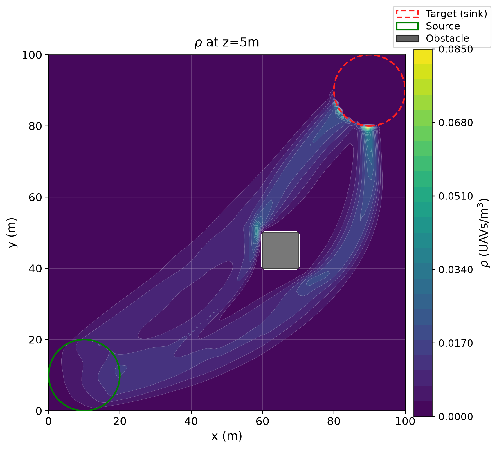
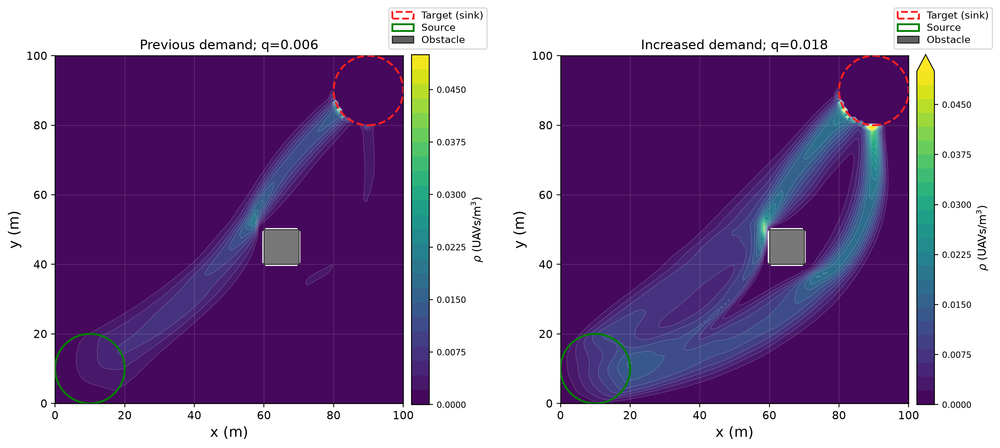

# UAV-MFG-Hybrid: independent ESWA reconstruction

[中文说明](README_zh.md) · [Reproduction](docs/REPRODUCTION.md) · [Migration](docs/MIGRATION.md) · [Validation evidence](validation/summary.json)

The current implementation is **`src/uav_mfg/`**, independently rebuilt from the
final revised manuscript submitted to *Expert Systems with Applications*
(ESWA-D-26-05581R1). It couples a PINN value function to conservative upwind
finite-volume density transport in static wind.

**The earlier `uavpinn/`, `paperconfig/`, and `runs/` tree is historical.** It is
preserved at [legacy/pre-eswa-reconstruction](https://github.com/ToughClimb/uav-mfg-hybrid/tree/legacy/pre-eswa-reconstruction)
and in Git history, and has been removed from the active tree. Its solvers,
parameters, checkpoints, and outputs were not used to compute the new results.
See [the migration record](docs/MIGRATION.md) before using an older checkout.

This is an audited reconstruction of the equations and workflow, with explicit
choices for experiment details omitted from the manuscript. It does **not**
claim exact reproduction of the original figures or numerical tables.
Graph initialization, a one-sided Bellman penalty, and residual-based training
skips are disclosed implementation additions. The optional diffusion model,
ABM, complete sensitivity studies, and strengthened 20,000-epoch monolithic
baselines are outside the current implementation and validation scope.

## Install in a local environment

Use Python 3.12+ and `uv`. The configured package mirror is Tsinghua PyPI.
All Python/CUDA runtime dependencies are installed into the project `.venv`.
On WSL, use the existing NVIDIA driver; do not install another driver or a
system CUDA toolkit for this project.

```bash
uv venv
uv sync --locked --extra test
.venv/bin/python -m pytest -q
```

The optional OpenMP FSM reference kernel uses an **existing** `g++` compiler:

```bash
.venv/bin/python scripts/build_native.py
.venv/bin/python -m pytest -q
```

Its library is written only to `build/`; the hybrid solver does not require it.

## Run the solver

Eight 3D demonstration cases, two independent GPU worker processes and eight
CPU threads per worker:

```bash
OMP_NUM_THREADS=8 OPENBLAS_NUM_THREADS=8 .venv/bin/python -m uav_mfg.cli run \
  --config configs/verified_demo.yaml --profile demo --workers 2 \
  --output results/eswa_rebuild --device cuda
```

An explicit CPU request uses CPU for both the PINN and transport:

```bash
OMP_NUM_THREADS=8 OPENBLAS_NUM_THREADS=8 .venv/bin/python -m uav_mfg.cli run \
  --config configs/verified_demo.yaml --profile diagnostic --cases p2p_none \
  --output results/cpu_diagnostic --device cpu
```

Requesting CUDA without a working GPU is an error; there is no silent fallback.
Grid profiles in the 3D configs are `diagnostic` = 20×20×8,
`demo` = 40×40×16, and `paper` = 100×100×50. A profile name specifies the grid,
not a guarantee that every experimental coefficient matches the original paper.
The explicitly reduced 2D figure configs use a single unit-thickness layer and
a 100×100 XY grid for their `paper` profile.

For the increased-demand experiments shown below:

```bash
.venv/bin/python scripts/run_high_density.py --workers 2
```

That command retains every initial trial, including failures. Follow
[the reproduction sequence](docs/REPRODUCTION.md) for unchanged-parameter
continuations, the separately reconstructed obstacle-Homing load, accepted-run
selection, baselines, and figure rendering. More demand does not guarantee
convergence, and an unconverged run is saved as `completed_unconverged`.

## What is checked

Each run saves its resolved config, seed, software versions, source hashes,
checkpoint, training/Picard logs, numeric fields, and stopping status. Density
transport uses one upwind flux per shared cell face, with zero outer-wall and
obstacle flux and one-way target absorption. CPU and CUDA-graph implementations
audit the same operator; the CUDA graph retains the mass budget at every step.
Continuations carry cumulative density-projection accounting.

Accepted figure sets require fresh flux audits, global relative mass imbalance
below 1e-3, accepted-density continuity residual below 1e-3, zero forbidden
boundary leakage, and zero cumulative projection loss. Rendering hashes the
input `fields.npz` files before and after and refuses unverified result sets.
Original manuscript files are optional private appearance references, supplied
only with `--reference-paper`; public reproduction does not need them.

## Computed examples and limits

The nine accepted increased-demand scenes have maximum relative mass imbalance
**3.679e-4** and maximum continuity residual **9.919e-4**, with zero forbidden
boundary flux and zero cumulative clipping loss. The resolved parameters,
field hashes, fresh audits, previous failed trials, and source provenance are
in [validation/](validation/README.md). These are measured reconstruction
results, not copied manuscript values.



The 2D P2P source rate was increased from 0.006 to 0.018; 3D source rates from
0.001 to 0.01. The reconstructed density bound is 0.25. The before/after figure
uses the same linear 0–0.05 scale on both sides; its upper colorbar arrow marks
values above 0.05 without clipping the numeric fields.



The density hotspot remains closer to the target than the source-side hotspot
in the manuscript. The reconstructed spherical 3D source also leaves the outer
height slices empty. Increasing demand improves visible density but does not
resolve those physical differences. The 2,000-epoch monolithic demonstration
fails its mass audit and is reported as such; no paper-level method ranking or
speed claim is made from it. See [model and scope details](docs/REIMPLEMENTATION.md)
and [figure semantics](docs/PAPER_FIGURES.md).

Code is distributed under the existing [Apache-2.0 license](LICENSE).
